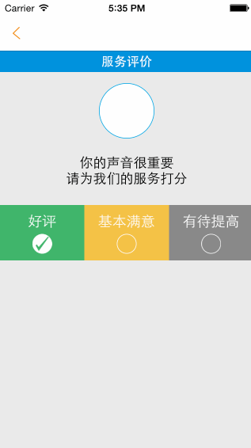

# CFSegmentControl
双版本分段选取控件
-----
    Charlin出框架的目标：简单、易用、实用、高度封装、绝对解耦！
    
-----

  

框架截图 CUT
===============
基本功能演示： 
 
  

项目实战：特别提示，此控件用于自定义复杂分段！基本功能请使用系统控件。
 
 

框架说明 EXPLAIN
===============
本框架以swift语言开发，但swift和oc均可使用。框架不在简单与复杂，在于功能实用。 

 

####框架特性： 
>1.双语可用：swift与oc均可实现调用。 
>2.可自定义样式，并以closure回调，无需代理。 
>3.本控件主要目的是解决高度自定义样式的分段选取。实际中，这个分段设计可能非常个性化，
因此您需要根据设计图自定义按钮并回传closure。
如果是简单分段选取，可直接使用系统控件即可。

 
框架依赖 DEPENDENCE
===============
无

 
使用说明 USAGE
===============

友盟文档：http://dev.umeng.com/social/ios/detail-share#1

SSO授权需要link以下系统libraries:
Security.framework
libiconv.dylib
SystemConfiguration.framework
CoreGraphics.Framework
libsqlite3.dylib
CoreTelephony.framework
libstdc++.dylib
libz.dylib

设置URL SCHEME 请参考官方文档。

#### 1. swift使用：

       let control = CFSegmentControl()
        
        let btn1 = UIButton()
        btn1.setTitleColor(UIColor.grayColor(), forState: UIControlState.Normal)
        btn1.setTitleColor(UIColor.redColor(), forState: UIControlState.Selected)
        btn1.setTitle("按钮一", forState: UIControlState.Normal)
        
        let btn2 = UIButton()
        btn2.setTitleColor(UIColor.grayColor(), forState: UIControlState.Normal)
        btn2.setTitle("按钮二", forState: UIControlState.Normal)
        btn2.setTitleColor(UIColor.redColor(), forState: UIControlState.Selected)
        
        let btn3 = UIButton()
        btn3.setTitleColor(UIColor.grayColor(), forState: UIControlState.Normal)
        btn3.setTitleColor(UIColor.redColor(), forState: UIControlState.Selected)
        btn3.setTitle("按钮三", forState: UIControlState.Normal)
        
        control.btns = [btn1,btn2,btn3]
            
        control.clickItemAtIndex = { (selectedIndex) -> Void in
            
            print("选中\(selectedIndex)")
        }
        
        
        control.frame = CGRectMake(0, 200, 320, 80)
        control.layer.borderWidth = 2
        control.layer.borderColor = UIColor.orangeColor().CGColor
        self.view.addSubview(control)
        self.control = control

  

